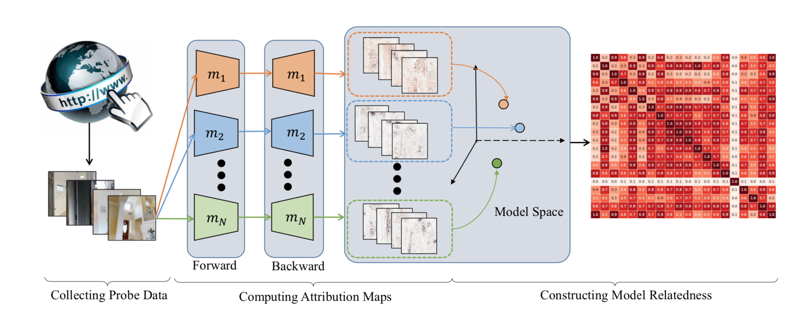
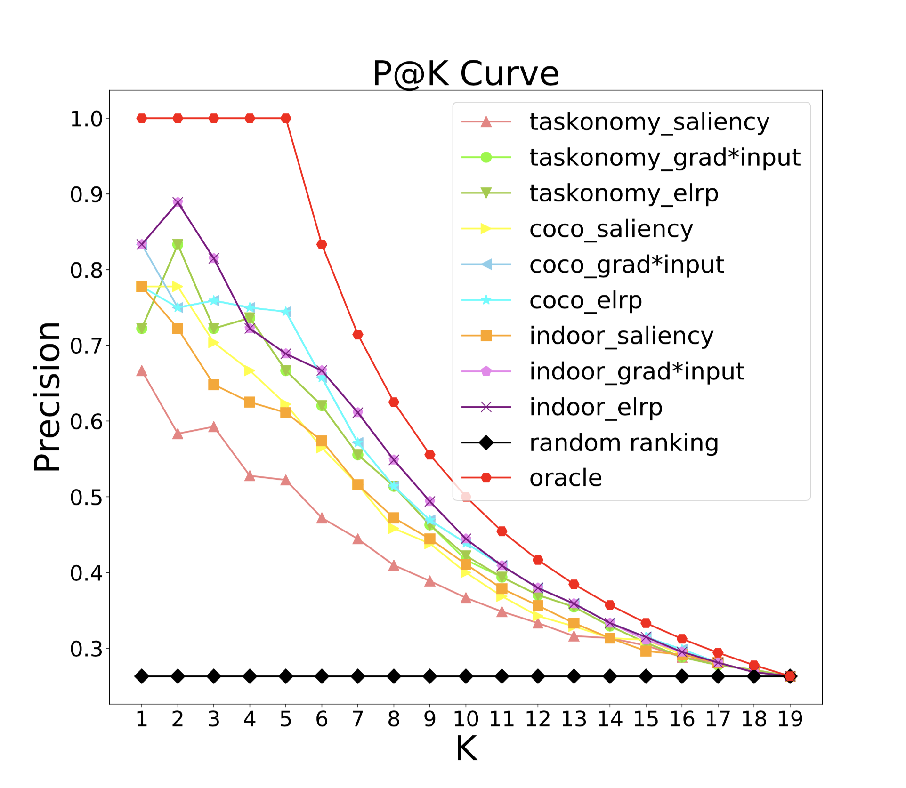
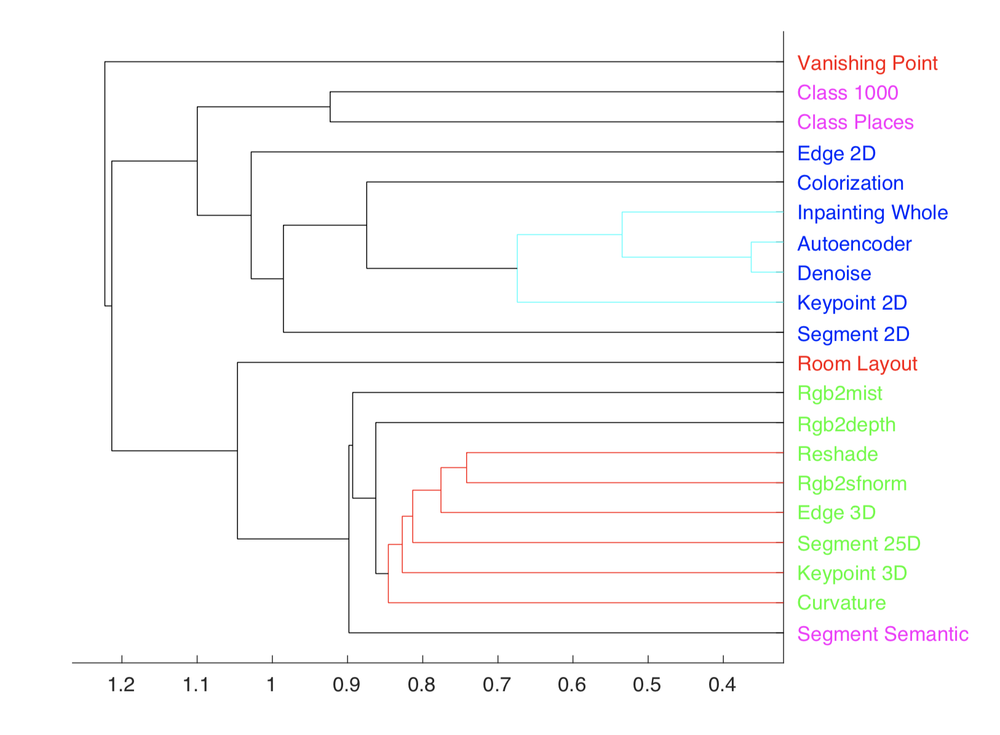

# Deep Model Transferbility from Attribution Maps

- [*"Paper: Deep Model Transferbility from Attribution Maps"*](https:), NeurIPS 2019.(released soon)

  J. Song, Y. Chen, X. Wang, C. Shen, M. Song



## Getting Started

These instructions below will get you a copy of the project up and running on your local machine for development and testing purposes.

### Prerequisites

Install the following:

```
- Python >= 3.6
- Tensorflow >= 1.10.0
- Matlab R2019a
```

Then, install python packages:

```
pip install -r requirements.txt
```

In order to generate attribution maps from Deep Models, you also need to download [DeepExplain](https://github.com/marcoancona/DeepExplain) which this project utilizes to generate attribution maps, and copy it to your project directory **$DIR**.

```
cp -r DeepExplain-master/deepexplain $DIR/lib/
```

### Probe datasets

Those datasets involved in this project are:

- [Taskonomy Tiny](https://github.com/StanfordVL/taskonomy/tree/master/data#downloading-the-dataset)
- [MS COCO Val 2014](http://images.cocodataset.org/zips/test2014.zip)
- [Indoor Scene](http://groups.csail.mit.edu/vision/LabelMe/NewImages/indoorCVPR_09.tar)

Make sure to download them and move to **$DIR/dataset**.

Those datasets need to be arranged in the following format:

```
|- dataset
|   |---taskonomy
|   |   |---collierville_rgb
|   |   |   |---point_0_view_0_domain_rgb.png
|   |   |   |---...
|   |   |---corozal_rgb
|   |   |---darden_rgb
|   |   |---markleeville_rgb
|   |   |---wiconisco_rgb
|   |---coco
|   |   |---COCO_val2014_000000000042.jpg
|   |   |---...
|   |---indoor
|   |   |---Images
|   |   |   |---airport_inside
|   |   |   |   |---airport_inside_0001.jpg
|   |   |   |---bowling
|   |   |   |---...
```

You can also check **$DIR/explain_result/name_of_dataset/imlist.txt** to find out how those images are arranged(Note that images in the *imlist.txt* are randomly selected from dataset, please feel free to test using more images).  

### Pre-trained Models

Download pre-trained models:

```
sh tools/download_model.sh
```

## Running the tests

First, generate Attribution Maps and save corresponding Attribution maps to explain results directory:

```
cd tools
python deep_attribution.py --explain_result_root explain_result --dataset taskonomy --imlist-size 1000
python deep_attribution.py --explain_result_root explain_result --dataset coco --imlist-size 1000
python deep_attribution.py --explain_result_root explain_result --dataset indoor --imlist-size 1005
```

Calculate affinity matrix of those tasks according to the Attribution Maps:

```
python affinity.py --dataset taskonomy --imlist-size 1000
python affinity.py --dataset coco --imlist-size 1000
python affinity.py --dataset indoor --imlist-size 1005
```

## Visualization

Plot P@K, R@K Curve, make sure you've already completed testing on three datasets:

```  
python plot.py --fig-save fig
```

Plot Task Similarity Tree:

```
matlab -nosplash -nodesktop task_similarity_tree.m
```

e.g.




## Citation

If you find this code useful, please cite the following:

```
@inproceedings{ModelTransfer_NeurIPS2019,
  title={Deep Model Transferbility from Attribution Maps},
  author={Jie Song, Yixin Chen, Xinchao Wang, Chengchao Shen, Mingli Song},
  booktitle={NeurIPS},
  year={2019}
}
```

## Todo

Release code of experiment generating attribution maps based on other kinds of pre-trained models(different tasks, different architectures, etc.).

Apply more explain methods and see how they work.

## Contact

If you have any question, please feel free to contact

Jie Song, sjie@zju.edu.cn; 

Yixin Chen, chenyix@zju.edu.cn.